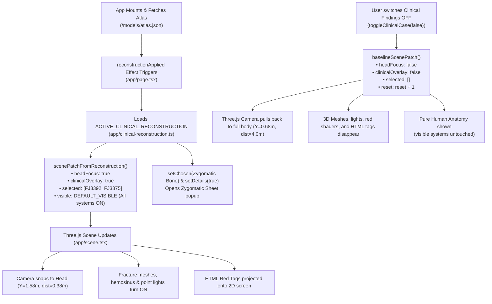

Searched for files: *clinical*
Searched for "Clinical Findings"
Viewed page.tsx:1-160
Viewed page.tsx:161-300
Searched for "scenePatchFromReconstruction"
Viewed page.tsx:370-440
Viewed clinical-reconstruction.ts:1-150
Viewed clinical-reconstruction.ts:145-179
Viewed page.tsx:840-920
Viewed page.tsx:921-1040
Viewed clinical-reconstruction-scene.ts:1-120
Viewed clinical-reconstruction-scene.ts:121-261
Searched for "headFocus"
Viewed scene.tsx:160-215
Viewed scene.tsx:216-300
Viewed scene.tsx:350-415
Viewed scene.tsx:416-470
Searched for "details &&"
Searched for "details"
Viewed page.tsx:1550-1662
Viewed anatomy.ts:1-60
Viewed anatomy.ts:61-100
Viewed anatomy.ts:101-140

Here is a detailed breakdown of how the startup initialization, camera framing, 3D trauma overlays, and toggle transitions operate across the codebase.

---

### High-Level Architecture Flow



---

### 1. Phase 1: App Boot & Initial Load

When you open or refresh the browser, the application goes through the following sequence:

#### A. Initial State & All Systems Toggles
In [`../../app/page.tsx`](file:///home/leafyishere/Swasth/app/page.tsx#L73-L97):
```ts
const initial: SceneState = {
  explode: 0,
  visible: DEFAULT_VISIBLE,   // <-- Contains all 13 standard body systems
  selected: [],
  isolate: false,
  view: 'three-quarter',
  ...
};
const [clinicalCaseOn, setClinicalCaseOn] = useState<boolean>(true);
```
- [`DEFAULT_VISIBLE`](file:///home/leafyishere/Swasth/app/anatomy.ts#L108) contains `'skeletal'`, `'muscular'`, `'cardiac'`, `'arterial'`, `'venous'`, `'nervous'`, etc.
- In the left **Systems** panel, every row's toggle switch checks `state.visible.includes(s.id)`. Because all of them are in `DEFAULT_VISIBLE`, **all system toggles appear active by default**.

#### B. Automatic Traumatic Case Activation
In [`../../app/page.tsx`](file:///home/leafyishere/Swasth/app/page.tsx#L385-L402):
```ts
const reconstructionApplied = useRef(false);
useEffect(() => {
  if (!atlas || reconstructionApplied.current) return;
  reconstructionApplied.current = true;
  
  const recon = ACTIVE_CLINICAL_RECONSTRUCTION;
  const concept = resolvePrimaryConcept(atlas, recon);
  setClinicalReport(recon.report);

  if (concept) {
    setChosen(concept);
    setState(s => ({
      ...s,
      ...scenePatchFromReconstruction(recon, atlas),
      reset: s.reset + 1,
    }));
    setDetails(true);       // <-- Opens the Zygomatic detail popup
    setPanel(null);
  }
}, [atlas]);
```
1. **Clinical Findings Panel**: Setting `setClinicalReport(recon.report)` causes `{clinicalReport && viewMode === 'anatomy' && ...}` in [`app/page.tsx#L850`](file:///home/leafyishere/Swasth/app/page.tsx#L850-L885) to render the top-right **Clinical Findings** card with the switch active.
2. **Zygomatic Detail Popup**: [`resolvePrimaryConcept()`](file:///home/leafyishere/Swasth/app/clinical-reconstruction.ts#L148-L155) matches concept `FMA52892` (Right Zygomatic Bone). Setting `setDetails(true)` opens the [`<Sheet>`](file:///home/leafyishere/Swasth/app/page.tsx#L1561) containing the radiology findings, modality badge, and impression summary.
3. **Clinical Scene Patch**: [`scenePatchFromReconstruction()`](file:///home/leafyishere/Swasth/app/clinical-reconstruction.ts#L117-L146) patches `state` with:
    - `headFocus: true`
    - `clinicalOverlay: true`
    - `clinicalGlow: true`
    - `clinicalSide: 'right'`
    - `selected: ['FJ3392', 'FJ3375']` (right zygoma + right maxilla)
    - `reset: reset + 1` (triggers camera and WebGL buffer updates).

---

### 2. Camera Framing & 3D Visuals in Three.js

When `SceneState` arrives at [`AnatomyScene`](file:///home/leafyishere/Swasth/app/scene.tsx):

#### A. Head Close-Up Framing
In [`../../app/scene.tsx`](file:///home/leafyishere/Swasth/app/scene.tsx#L171-L184):
```ts
// if ((latest.current.headFocus || latest.current.clinicalOverlay || ...) && extent < .1) {
//   const face = latest.current.clinicalSide; // 'right'
//   const headDirection = face === 'right' ? new T.Vector3(-.45, .1, 1).normalize() : ...;
//   const headTarget = new T.Vector3(0, 1.58, 0.03); // Y = 1.58m corresponds to skull height
//   const headDistance = mobile ? 0.48 : 0.38;       // 38 cm distance close-up!
//
//   controls.target.copy(headTarget);
//   camera.position.copy(headTarget).addScaledVector(dir, headDistance);
//   controls.update();
//   return;
// }
```
Because `headFocus` and `clinicalOverlay` are true, the camera skips the standard full-body orbit target (`Y=0.68m`, `dist=4.0m`) and snaps directly to the head coordinates (`Y=1.58m`) at a close distance of `0.38m`.

#### B. 3D Fracture Lines, Fluid Volume, and Burn Glow
In [`../../app/clinical-reconstruction-scene.ts`](file:///home/leafyishere/Swasth/app/clinical-reconstruction-scene.ts):
- **Fracture Cylinders**: 7 geometric cylinder segments ([lines 90–104](file:///home/leafyishere/Swasth/app/clinical-reconstruction-scene.ts#L90-L104)) connect 3D coordinates tracing the right orbital floor, lateral orbit wall, zygomatic arch, and maxillary antrum.
- **Hemosinus Mesh**: A semi-transparent ellipsoid mesh ([lines 128–136](file:///home/leafyishere/Swasth/app/clinical-reconstruction-scene.ts#L128-L136)) sits inside the right maxillary cavity at `(-0.027, 1.560, 0.056)`.
- **GPU Bone Tint**: In [`app/scene.tsx#L425`](file:///home/leafyishere/Swasth/app/scene.tsx#L425-L428), `CLINICAL_HIGHLIGHT_RGBA` paints bright red (`RGBA [220, 24, 32, 235]`) directly into the GPU selection texture buffer for bone meshes `FJ3392` and `FJ3375`.
- **Pulsing Animation**: `clinicalHandle.tick()` modulates point lights (`burnLight`, `orbitLight`) and mesh emissive values in sync with the clock.

#### C. Red 2D HTML Tags on the 3D Model
In [`app/scene.tsx#L216-L244`](file:///home/leafyishere/Swasth/app/scene.tsx#L216-L244), `updateClinicalLabels()` takes the 4 3D anchor points (`fx-zygoma`, `fx-orbit`, `fx-antrum`, `granuloma`):
```ts
projectedLabel.copy(a.world).project(camera);
elNode.style.left = `${(projectedLabel.x + 1) * el.clientWidth / 2}px`;
elNode.style.top = `${(1 - projectedLabel.y) * el.clientHeight / 2}px`;
```
It transforms their 3D world coordinates into screen pixel positions on every frame, pinning the pulsing red HTML badges directly over the anatomical structures.

---

### 3. Phase 2: Closing the Toggles (Switching to Normal Anatomy)

When you toggle the switch on the **Clinical Findings** panel off:

#### A. React State Update
In [`app/page.tsx#L117-L136`](file:///home/leafyishere/Swasth/app/page.tsx#L117-L136):
```ts
const toggleClinicalCase = (enabled: boolean) => {
  setClinicalCaseOn(enabled);
  if (!atlas) return;
  if (enabled) {
    ...
  } else {
    setState(s => ({
      ...s,
      ...baselineScenePatch(), // <-- Reset trauma properties
      reset: s.reset + 1,       // <-- Forces camera & Three.js to recompute
    }));
  }
};
```
[`baselineScenePatch()`](file:///home/leafyishere/Swasth/app/clinical-reconstruction.ts#L157-L174) returns:
```ts

// {
//   selected: [],
//   isolate: false,
//   headFocus: false,
//   clinicalOverlay: false,
//   clinicalGlow: false,
//   clinicalHighlightPartIds: [],
// }
```

#### B. Three.js Reset Execution
1. **Camera Transitions to Full Body**:
    - In [`app/scene.tsx#L172`](file:///home/leafyishere/Swasth/app/scene.tsx#L172), `latest.current.headFocus` and `clinicalOverlay` are now `false`.
    - The code falls through to the normal camera solver ([line 186–187](file:///home/leafyishere/Swasth/app/scene.tsx#L186-L187)):
      ```ts
      controls.target.set(..., mobile ? .85 : .68, 0); // Centers on the torso/abdomen
      camera.position.copy(controls.target).addScaledVector(direction, distance); // Distance ~ 4.0m
      ```
      This pulls the camera back to display the full standing human body.

2. **3D Injury Overlays Disappear**:
    - `clinicalHandle.setVisible(false)` immediately hides all fracture cylinders, the hemosinus mesh, frontal granuloma, and point lights ([line 370](file:///home/leafyishere/Swasth/app/scene.tsx#L370)).
    - `clinicalLabels.hidden = true` hides all floating red tags ([line 217](file:///home/leafyishere/Swasth/app/scene.tsx#L217)).

3. **GPU Selection Buffer Cleared**:
    - For all previously highlighted parts, `selectedData.set([0, 0, 0, 0], i * 4)` clears the red burn heat tint back to standard bone shading ([lines 463–468](file:///home/leafyishere/Swasth/app/scene.tsx#L463-L468)).

4. **Why Normal Full-Body Anatomy is Displayed**:
    - Notice that `baselineScenePatch()` **does not modify `state.visible`**.
    - `state.visible` still retains its original systems (skeleton, muscles, organs, etc.).
    - With `selected: []` and `isolate: false`, every enabled system mesh is rendered normally, giving you the clean, uninjured full-body human model.